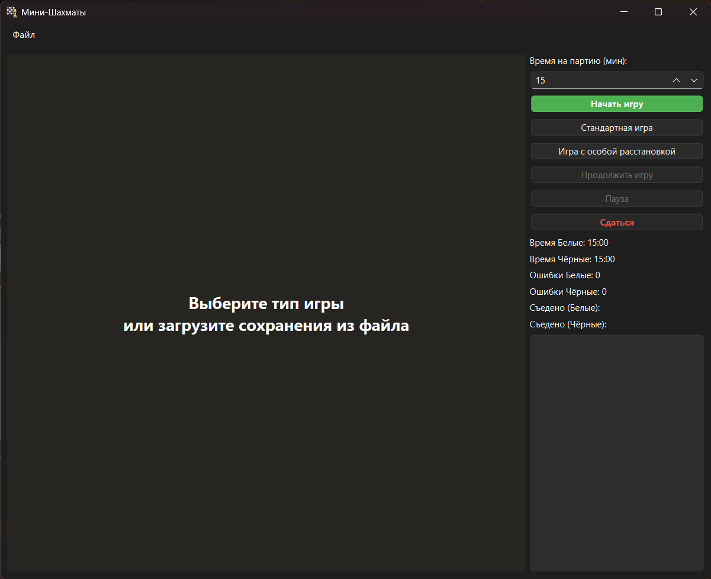
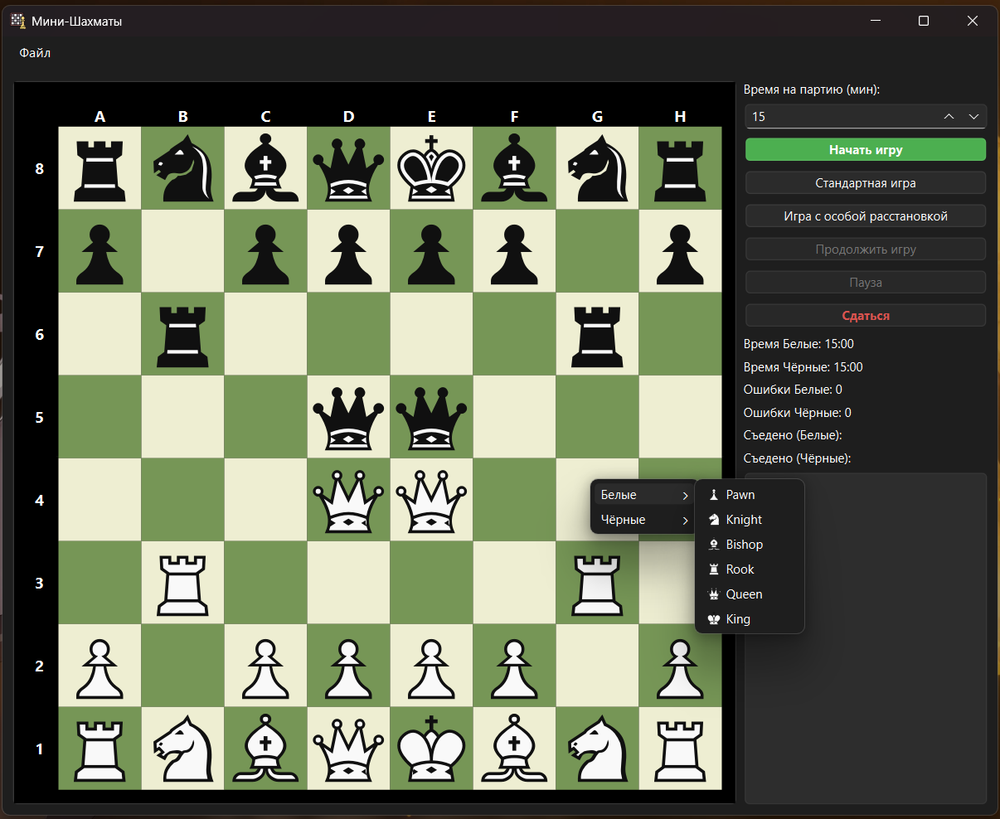
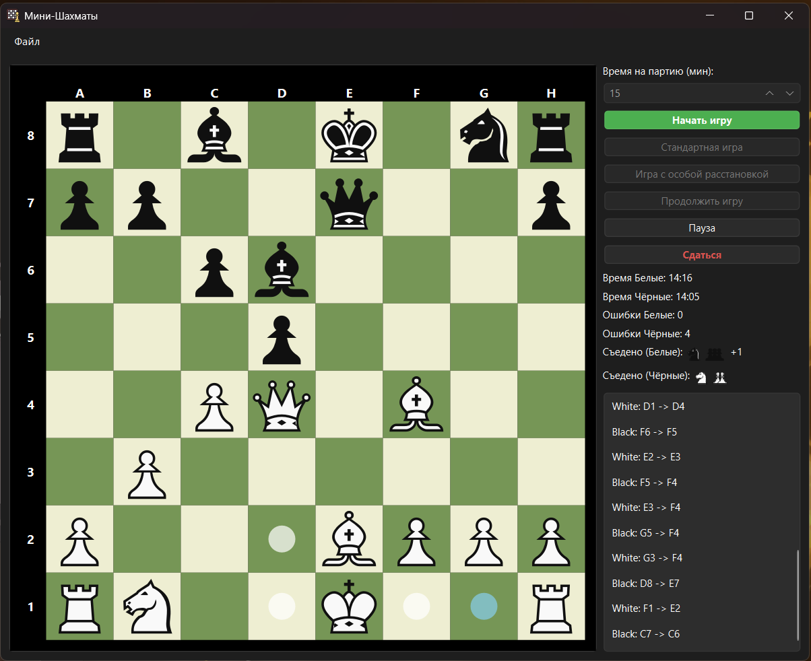

# Мини-шахматы (MiniChess)

Легкое и автономное десктопное приложение для игры в шахматы, написанное на **C++/Qt 6**. Играйте в классические партии, решайте шахматные задачи или создавайте собственные безумные расстановки!

## Скриншоты игрового процесса

* На фото: Главное меню приложения «Мини-шахматы» перед началом партии.

* На фото: Режим расстановки фигур игры.

* На фото: Игровой процесс.

## 🎮 Основные возможности

* **Честный шахматный движок:** Строгое соблюдение всех правил FIDE. Поддерживаются рокировки, взятие на проходе, превращение пешек, а также корректное определение шаха, мата и пата, ничьей по правилу 50 ходов и по правилу о трёхкратном повторении позиции.
* **Режим свободной расстановки:** Устали от классического начала? Вы можете расставить любые фигуры на доске в произвольном порядке и начать партию прямо с этой позиции.
* **Система сохранений и загрузок:**
  * Экспортируйте свои уникальные **расстановки** в файлы (папка `setups\`), чтобы делиться ими или возвращаться к ним позже.
  * Ставьте игру на паузу и сохраняйте активные **партии** (папка `games\`). Сохраняется всё: позиция на доске, время на таймерах и полная история ходов.
* **Удобный интерфейс:** Полностью на русском языке, поддержка полноэкранного режима (клавиша **F11**), таймеры, подсветка возможных ходов и панель съеденных фигур.

---

## 🚀 Как начать играть (Без компиляции)

Если вы просто хотите поиграть, вам не нужно устанавливать среду разработки или разбираться в коде! Игра скомпилирована в один независимый файл (для Windows 11 x86-64 архитектуры).

1. Зайдите в папку `bin/` в этом репозитории.
2. Скачайте архив с желаемой версией игры (например **`chess_0_1_0.zip`**).
3. Распакуйте архив в любую папку на вашем ПК и запустите `MiniChess.exe`. Всё!

В архиве уже заботливо подготовлены папки с базовыми шаблонами, которые можно загрузить прямо в главном меню игры:

* `setups\standart_setup.txt` — классическая стартовая расстановка фигур.
* `games\standart_game.txt` — пример сохраненной классической партии.

> **⚠️ Примечание:** При первом запуске защитник Windows (SmartScreen) может показать синее окно с предупреждением о запуске неизвестного приложения. Это стандартная реакция Windows на бесплатные программы от независимых разработчиков. Просто нажмите **«Подробнее» (More info)**, а затем **«Выполнить в любом случае» (Run anyway)**.

---

## 🛠 Для разработчиков (Сборка из исходников и разработка)

Проект полностью открыт и готов к сборке! Для предложений по разработке создавайте Pool Request'ы!

* **Язык:** C++ (стандарт C++17)
* **Фреймворк:** Qt 6.x
* **Компилятор:** MinGW 64-bit

Все графические ассеты (SVG-фигуры) вшиты в бинарник через систему ресурсов (`.qrc`). Для достижения максимальной портативности и получения одного `.exe` файла без зависимостей от `.dll`, бинарник в папке `bin` был собран с использованием статической версии Qt 6 и флагами линковщика `-static -static-libgcc -static-libstdc++` (их можно убрать, отредактировав `Chess.pro`).
